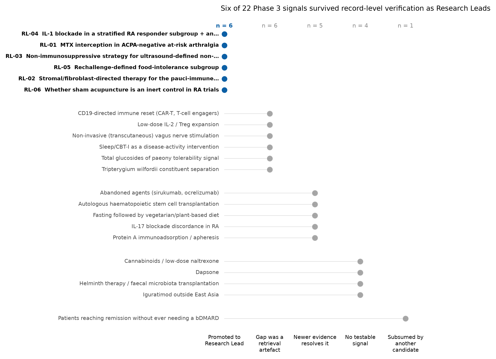

> **Archived phase report — a dated record of what was believed at the time, not the current state of the project.**
> Statements superseded by later verification are listed in `data/corrections_log.csv`. Check that log before citing anything in this file.
> Current lead status is in `data/research_leads_status.csv`.

> **This file contains two statements later found to be wrong (corrections C1 and C2) and one lead whose stated basis was reframed (correction V5).**

# RA Open Therapeutics #001 — Phase 4: Research Leads

**Scope.** This phase tests the 22 signals in the *What might be worth studying* section of the Phase 3 Open Treatment Map against a formal Research Lead bar. Each candidate was verified against primary records — PubMed abstracts retrieved through E-utilities and ClinicalTrials.gov entries retrieved through the registry API — rather than against the Phase 3 summary text. Six candidates survived. Sixteen did not, and the reasons are recorded rather than discarded.

Nothing in this document is a treatment recommendation, and no claim of efficacy is made for any intervention named here. A Research Lead is a statement that a question is open and testable, not that an answer is expected.

## How candidates were tested

Each candidate was put through four checks:

1. **Is the signal real?** Does a primary record exist that says what the Phase 3 register claims it says?
2. **Has newer evidence already resolved it?** Searches were run forward to 2026 for each signal.
3. **Is the apparent gap a retrieval gap?** Absence from the Phase 3 literature set is not absence from the literature; and absence from the literature is not absence from the trial pipeline, so ClinicalTrials.gov was searched for every surviving candidate.
4. **Do methodological or safety problems substantially weaken the case?**

A candidate was promoted only if it survived all four and yielded a specific question that a defined study could answer.

Two corrections to the Phase 3 register arose during verification and are recorded here:

- The PMID attached to the food-intolerance subgroup signal resolved to an unrelated paper in a different field. The correct primary sources are **PMID 1575571** and **PMID 1575572**.
- The automated audit of the ACPA-negative interception signal classified it as too weak on the basis of the 4-year subgroup analysis alone. Reading the 5-year publication (PMID 42392130), which reports the autoantibody-stratified analysis with additional event accrual and the authors' own conclusion that the two serostatus groups need different strategies, together with registry evidence that no trial is enrolling this population, overrode that verdict. The statistical fragility that drove the original verdict is retained below as counter-evidence.

## Triage of all 22 candidates

| Outcome | n | Meaning |
|---|---|---|
| 🔎 Research Lead | 6 | Survived verification with a specific testable question |
| Retrieval gap | 6 | The "untested" framing was an artefact of incomplete search; relevant human work exists or is running |
| Resolved | 5 | Newer evidence, usually a synthesis published after the original signal, answers the question |
| No testable signal | 4 | The signal is real but too weak, too toxic, or too unspecified to generate a study |
| Duplicate | 1 | Subsumed by another candidate |

Full detail, including the identifiers behind each outcome, is in `ra_phase4_candidate_triage.csv`.

---

# 🔎 Research Leads

## RL-01 — Methotrexate-based interception in ACPA-negative at-risk arthralgia

*Lead type: Unreplicated human clinical signal in a subgroup that may respond differently*

**Observation / signal.** In TREAT EARLIER, a time-limited intervention (one 120 mg intramuscular methylprednisolone injection plus 1 year of methotrexate up to 25 mg/week) in people with clinically suspect arthralgia and subclinical joint inflammation was negative for its overall primary endpoint, but on ACPA-stratified follow-up the effect on progression to RA was confined to ACPA-negative participants at increased predicted risk: 3/35 (9%) treated vs 10/31 (32%) placebo developed RA over 5 years (HR 0.24, 95% CI 0.07-0.87, p=0.018; NNT 4), with sustained physical-function benefit (HAQ mean difference -0.16, 95% CI -0.29 to -0.04, p=0.0082). In ACPA-positive participants, 18/31 (58%) vs 15/23 (65%) progressed (HR 0.75, 95% CI 0.38-1.49, p=0.41) and the 2-year function benefit was not sustained.

**Why it is scientifically interesting.** It inverts the field's operating assumption. The entire RA-prevention pipeline is built on ACPA/RF positivity as the entry criterion, and the seropositive-directed trials have been null or non-durable. If interception works preferentially in seronegative at-risk individuals, the pipeline is selecting against the population most likely to benefit. The trial's own authors conclude that different strategies are needed for ACPA-positive and ACPA-negative at-risk individuals.

**Evidence supporting it.** TREAT EARLIER is a randomised, double-blind, placebo-controlled multicentre trial (13 Dutch centres, n=236, 91% completed 5-year follow-up). The ACPA-negative signal appears consistently in two successive analyses with independent event accrual: 4-year data (3/35 vs 9/31, HR 0.27, 95% CI 0.07-0.99, p=0.034; PMID 39303731) and 5-year data (PMID 42392130). The direction is concordant across three outcome domains in the ACPA-negative increased-risk stratum (progression to RA, physical function, subclinical inflammation/grip strength). The risk-stratification dependency is internally coherent: no effect in the ACPA-negative low-risk stratum (4/53 vs 6/63, HR 0.79, 95% CI 0.22-2.80).

**Strongest evidence against it.** The parent trial was negative for its primary endpoint (26/119 vs 31/117 developed RA, HR 0.79, 95% CI 0.47-1.34, p=0.38), so this is a subgroup of a null trial. The subgroup is small (n=66) and event-driven (13 events total); the confidence interval reaches 0.87 at its upper bound and reached 0.99 in the 4-year analysis. The stratum is defined jointly by serostatus and a risk-prediction model, i.e. a two-way split with attendant multiplicity. No independent trial has enrolled ACPA-negative at-risk individuals: APIPPRA (abatacept, PMID 38364839) and its long-term extension ALTO (PMID 41576971), the hydroxychloroquine phase 2 (PMID 40884017), and the palindromic-rheumatism trial (PMID 42135532) were all seropositive-entry, and the ClinicalTrials.gov search returned no interventional prevention trial recruiting ACPA-negative at-risk individuals. Separately, seronegative at-risk populations are systematically under-represented in RA trials (PMID 39455473), so the finding rests on a single cohort.

**Main uncertainty.** Whether this is a real biological difference between seronegative and seropositive pre-RA, or a small-sample artefact of a subgroup analysis in an overall-null trial. A secondary uncertainty is what the risk-prediction model is actually selecting - it may be identifying people with subclinical inflammation who would be classified as RA on any given day, so the 'prevention' effect could partly be delayed classification rather than altered trajectory.

**Specific unanswered research question.** In ACPA-negative individuals with clinically suspect arthralgia, subclinical joint inflammation on imaging, and a model-predicted increased risk of progression, does a time-limited glucocorticoid-plus-methotrexate intervention reduce 3-5 year incidence of clinically apparent RA relative to placebo?

**What would confirm or reject it.** Confirm: an independent, adequately powered, double-blind placebo-controlled trial recruiting exclusively ACPA-negative at-risk individuals with imaging-confirmed subclinical synovitis and prospectively applied risk stratification, powered on progression to RA (the observed HR of ~0.25 with a ~30% placebo event rate implies roughly 250-350 participants for 80% power) with a prespecified functional co-primary and >=3 years of post-treatment follow-up. Reject: a null result in such a trial, or a pooled individual-participant-data analysis of seronegative at-risk participants across cohorts showing no serostatus-by-treatment interaction. An interim, cheaper test: individual-participant-data pooling of the ACPA-negative arms of existing at-risk cohorts and trials to estimate the interaction term directly.

## RL-02 — No therapeutic has ever been directed at the stroma in the pauci-immune (fibroid) RA pathotype

*Lead type: New disease biology that makes an untried therapeutic direction testable; a subgroup that responds differently*

**Observation / signal.** A reproducible synovial pathotype - pauci-immune/fibroid, characterised by sparse immune infiltrate and enrichment of fibroblast, extracellular-matrix and cell-adhesion programmes - is present in up to a quarter of treatment-naive early RA and predicts poor response across drug classes including TNF inhibitors, rituximab and tocilizumab. Every drug ever tested in these patients targets immune cells. Registry search returned no interventional trial of a stromal-directed therapeutic in RA: the only fibroblast-related RA studies are FAP-targeted PET imaging (NCT04514614) and a planned circulating-FAP biomarker study (NCT07393217).

**Why it is scientifically interesting.** The pathotype is a prospectively identifiable, biopsy-verifiable subgroup with a described molecular driver set - an endothelial-fibroblast signalling network involving Notch and TGF-beta, with DKK3+ sublining fibroblasts associated with refractoriness and CD200+ fibroblasts with resolution - and a documented pattern of multidrug resistance. This is the rare case where a mechanistic hypothesis, a patient-selection assay, and a clinical failure pattern already line up, and the corresponding intervention has simply never been attempted.

**Evidence supporting it.** Pathotype-response associations come from biopsy-driven randomised trials (R4RA, STRAP), in which diffuse-myeloid synovitis responds to IL-6 receptor blockade, lympho-myeloid to B-cell depletion, and fibroid synovitis shows multidrug resistance (reviewed PMID 41440985). The stromal basis of refractory arthritis, the pathotype prevalence figures, and the Notch/TGF-beta endothelial-fibroblast network are set out in PMID 42662104. Ultrasound-based cohort work independently shows that a large fraction of difficult-to-treat RA has no detectable power-Doppler synovitis (PMID 38059326, PMID 42370095), consistent with a non-immune-driven component. Synovial-biopsy stratification is now clinically feasible, and pathotype-guided treatment trials have begun (e.g. NCT06301373, methotrexate plus tofacitinib in myeloid-stromal RA).

**Strongest evidence against it.** There is no clinical evidence that targeting the stroma changes RA outcomes - the direct evidence for this lead is zero, and that is the point of the lead but also its principal weakness. Anti-fibrotic and stromal-directed agents have a poor translational record in other fibrotic indications, and no fibroblast-selective agent with an acceptable safety profile is clinically available for RA. The pathotype classification is not fully stable: pathotypes can shift with treatment, sampling is joint-specific, and the fibroid label may partly capture low-inflammation states that overlap with RL-03 rather than a distinct fibroblast-driven disease. Some symptom burden in this group is attributable to fibromyalgia and obesity rather than synovial biology.

**Main uncertainty.** Whether the fibroid pathotype is a causal, stroma-driven disease state that would respond to stromal-directed therapy, or a descriptive end-state of burnt-out or never-inflamed synovium in which no drug will help. Also unresolved: whether a systemically tolerable fibroblast-directed intervention exists at all.

**Specific unanswered research question.** In patients with active RA and a biopsy-confirmed pauci-immune/fibroid pathotype who have failed at least two classes of b/tsDMARD, does a stromal-directed intervention (e.g. Notch or TGF-beta pathway modulation, or FAP-directed delivery) reduce synovial fibroblast activation and disease activity relative to continued standard care?

**What would confirm or reject it.** Confirm: a biopsy-stratified, randomised, placebo-controlled proof-of-mechanism trial in fibroid-pathotype RA with paired pre/post synovial biopsies, in which the primary endpoint is a prespecified stromal molecular response (fibroblast-activation signature, DKK3+/CD200+ subset shift) and clinical response is secondary. Reject: absence of a stromal molecular response despite confirmed target engagement, or a positive stromal response with no clinical or structural correlate. A necessary preliminary step is a non-interventional one: prospective confirmation that the fibroid pathotype prospectively predicts non-response, in a cohort large enough to separate it from fibromyalgia and low-inflammation confounders.

## RL-03 — Non-inflammatory refractory RA has never been randomised to a non-immunosuppressive strategy

*Lead type: Replicated observational phenomenon with an unresolved conflict and no trial*

**Observation / signal.** Among patients meeting EULAR difficult-to-treat RA criteria who are assessed with musculoskeletal ultrasound, a large minority have no detectable power-Doppler synovitis - 46/107 (43%) in a cross-sectional study of 1,469 patients on b/tsDMARDs (PMID 38059326) and 20/45 (44%) in an independent single-centre cohort (PMID 42370095). These patients are, by construction, receiving escalating immunosuppression for symptoms that no imaging measure attributes to synovial inflammation, and they carry higher BMI and substantially higher fibromyalgia prevalence. No trial has randomised them to an alternative, non-immunosuppressive management strategy.

**Why it is scientifically interesting.** If a meaningful share of the difficult-to-treat population is not inflammation-driven, then a proportion of current b/tsDMARD cycling in RA delivers infection and cost risk with no plausible mechanism of benefit. This is one of the few RA questions where the plausible result of a trial is de-escalation rather than a new drug, and where the intervention (imaging-guided strategy assignment) requires no new molecule.

**Evidence supporting it.** The phenomenon is replicated across independent cohorts using an objective imaging criterion (PMID 38059326, PMID 42370095), and the associated clinical profile is consistent between them (higher BMI, higher fibromyalgia prevalence, lower objective inflammatory burden). Ultrasound stratification of difficult-to-treat RA is systematically supported (PMID 39557317, PMID 38085537). Synovial biopsy in difficult-to-treat RA similarly distinguishes inflammatory from non-inflammatory drivers of persistent symptoms (PMID 41440985).

**Strongest evidence against it.** The strongest counter-evidence is direct and recent. In the multicentre FIRST registry, among 173 patients with low-inflammatory difficult-to-treat RA (swollen 28-joint count <=1, CRP <10 mg/L), propensity-matched analysis found that those who switched b/tsDMARD improved more than those who did not (CDAI change -6.6 vs -2.2; pain -15.3 vs -3.4; both p<0.05), and improvement was seen even in patients with low-grade sonographic activity (greyscale <=1, power Doppler 0) (PMID 41644272). Independently, 17/37 (46%) of patients classified as controlled refractory RA had subclinical synovitis on ultrasound (PMID 42370095), showing that a negative power-Doppler signal does not reliably mean absence of inflammation. Radiographic erosion rates did not differ between the inflammatory and non-inflammatory subgroups. Poly-refractory RA - the group with the clearest inflammatory phenotype - is uncommon (40/1,469, 2.7%), so the target population's boundaries are unstable across definitions.

**Main uncertainty.** Whether ultrasound-defined absence of power-Doppler synovitis identifies patients who genuinely cannot benefit from further immunosuppression, or merely patients whose inflammation is below the detection threshold of the modality. The FIRST registry result is small (15 vs 30 matched patients), non-randomised, and directly opposed to the lead's premise, so the conflict is live.

**Specific unanswered research question.** In patients with EULAR-defined difficult-to-treat RA and no power-Doppler synovitis on standardised ultrasound, does a strategy of switching b/tsDMARD produce greater improvement in pain and function at 6-12 months than a strategy of holding immunosuppression stable and treating non-inflammatory contributors (pain-centred and weight/comorbidity-directed management)?

**What would confirm or reject it.** Confirm the lead (i.e. that immunosuppression escalation is futile here): a randomised strategy trial with the design above showing no advantage for switching, with prespecified subgroup analysis by fibromyalgia status and BMI, ultrasound reading centralised and blinded, and structural progression captured as a safety endpoint. Reject: a switching advantage of a magnitude comparable to the FIRST registry estimate, which would confirm that ultrasound-negative status does not identify treatment-futile patients. Either result is directly actionable, which is what makes the trial worth running.

## RL-04 — A completed, adequately sized modern IL-1 trial in RA has not reported, while the responder-subgroup hypothesis remains untested

*Lead type: An abandoned therapeutic direction; a completed trial whose result has not been made available*

**Observation / signal.** IL-1 blockade in RA is generally regarded as a closed question on the basis of modest unstratified effects, yet two things are true at once. First, the responder-subgroup hypothesis - that a definable minority of RA is IL-1-driven and would respond substantially - has never been tested prospectively with stratification. Second, a modern randomised, double-blind, placebo-controlled phase 2 trial of an anti-IL-1alpha antibody added to methotrexate in RA (NCT05363891, XBiotech, n=243) completed on 2024-10-31, and as of this search has no results posted on ClinicalTrials.gov (has_results = False) and no publication located in PubMed.

**Why it is scientifically interesting.** Under this project's principle that negative results are valuable, an unreported 243-patient placebo-controlled RA trial is a concrete, addressable evidence gap - the answer exists and is simply not in the public record. It is also the specific piece of information that would determine whether the IL-1 direction in RA is genuinely dead or merely undifferentiated, since the trial targets IL-1alpha rather than the IL-1beta/IL-1R axis addressed by earlier agents.

**Evidence supporting it.** Published synthesis of IL-1-targeted biologics in RA describes robust early efficacy with diminishing returns in later-stage disease, and explicitly identifies precise patient stratification as the unmet requirement (PMID 40520203). Registry records confirm the trial's existence, design (phase 2, double-blind, placebo-controlled, methotrexate background), enrolment (243), sponsor and completion date, and confirm that no results have been posted. Searches for the compound and for anti-IL-1alpha antibody trials in RA returned no corresponding publication.

**Strongest evidence against it.** The historical record is genuinely unfavourable: anakinra's effect sizes in RA were smaller than those of TNF inhibitors, which is why it was displaced, and it requires daily injection. Absence of a publication in PubMed is not proof of non-publication - the result may appear in a conference abstract, a regulatory filing, or a journal not indexed at the time of this search, so this element of the lead is falsifiable by a single retrieval. The stratification hypothesis itself has no direct clinical support in RA; the retrieved records supporting an IL-1-driven subgroup are mechanistic and cross-disease (Still's disease, IL1RN genetics) rather than RA-specific, and cytokine redundancy is an established reason single-pathway IL-1 inhibition underperforms.

**Main uncertainty.** Whether the completed trial was positive, negative, or terminated for non-efficacy reasons is simply unknown, and this uncertainty dominates the lead. Downstream of that: whether an IL-1-high RA subgroup can be prospectively identified at all, and by what biomarker.

**Specific unanswered research question.** Two questions, in order. (1) What was the outcome of NCT05363891, the completed 243-patient placebo-controlled phase 2 trial of anti-IL-1alpha added to methotrexate in RA? (2) If a signal exists, does a prospectively defined IL-1-high subgroup (candidate markers: IL-1alpha/IL-1beta or IL-1Ra synovial or serum profile, IL1RN genotype, myeloid-rich synovial pathotype) show a clinically meaningful response to IL-1 blockade that the unstratified population does not?

**What would confirm or reject it.** For (1): direct retrieval - results posting on ClinicalTrials.gov, a sponsor disclosure, conference abstract, or regulatory summary. This is a documentation task, not an experiment, and should be attempted before any further work on this lead. For (2): confirm with a biomarker-stratified randomised trial in which the prespecified IL-1-high stratum shows a response separating from both placebo and the IL-1-low stratum (a treatment-by-stratum interaction, not merely a positive stratum). Reject: no interaction in such a trial, or a clearly null result in the unreported trial with no evidence of subgroup heterogeneity in its own data.

## RL-05 — A rechallenge-defined food-intolerance subgroup in RA, untested for over thirty years

*Lead type: Abandoned human clinical signal with a defined subgroup and objective measurements, never followed up*

**Observation / signal.** A double-blind controlled elimination-diet trial in RA reported that a minority of patients showed reproducible symptom worsening on blinded reintroduction of specific foods, with the companion report describing accompanying clinical and histological findings in responders (PMID 1575571, PMID 1575572, 1992). The design is unusual in the RA dietary literature because it defines the responder subgroup by blinded provocation rather than by self-report. No trial using elimination plus blinded rechallenge in RA appears in the registry in the three decades since; the modern dietary RA trials that exist test whole-diet patterns (anti-inflammatory diet, vegan, fibre, fasting) in unselected populations, and the one modern fasting/plant-based RCT was terminated (NCT03856190, n=53).

**Why it is scientifically interesting.** It is a within-patient, blinded, randomised-order design that in principle isolates a food-specific effect in an individual - the strongest available design for a subgroup that cannot be identified in advance. If a reproducible provocation response exists in even a small fraction of RA patients, it defines a mechanistically tractable subgroup (mucosal/mast-cell or IgE-mediated) with a low-risk intervention. The signal was not refuted; it was left.

**Evidence supporting it.** The primary trial was double-blind and controlled, the responder definition was based on blinded rechallenge rather than open report, and the companion paper reports objective clinical and tissue-level correlates in the responder subset rather than symptom scores alone. Contemporary interest in diet-microbiome-mucosal mechanisms in RA gives the observation a mechanistic frame it lacked in 1992. Registry search confirms the absence of any subsequent elimination-plus-rechallenge trial in RA, so this is not a retrieval artefact of the literature search.

**Strongest evidence against it.** The evidence base is a single small trial from 1992 with no replication, reported before modern standards for trial registration, outcome prespecification and multiplicity control. Broad dietary interventions in RA have been extensively studied since and their pooled effects are modest and confounded by weight loss, expectancy and co-intervention; the closest modern replication of a historical dietary design was terminated before completion. Dietary self-report and symptom outcomes in RA are strongly susceptible to expectancy effects, and the subgroup's size in the original trial was small enough that chance reproducibility on rechallenge cannot be excluded. There is also a publication-era concern: an unreplicated positive dietary finding from the early 1990s that generated no follow-up may have failed replication informally.

**Main uncertainty.** Whether a reproducible, food-specific provocation response exists in RA at all, and if so what fraction of patients have it and whether it tracks any objective inflammatory measure rather than symptom report alone. A specific methodological uncertainty is whether blinded food challenge can be delivered with adequate masking using modern encapsulated or matched-vehicle challenge materials.

**Specific unanswered research question.** In patients with RA who report reproducible food-associated symptom flares, does blinded, randomised-order, placebo-controlled food challenge elicit a reproducible worsening in an objective inflammatory or symptom-composite measure, in a definable minority of patients?

**What would confirm or reject it.** Confirm: a series of randomised, double-blind, placebo-controlled within-patient crossover challenges (n-of-1 design with multiple challenge/placebo pairs per participant, aggregated across participants) demonstrating within-patient reproducibility of the response in a prespecified subset, with at least one objective outcome (CRP, ultrasound synovitis, or faecal/serum mucosal marker) alongside symptom outcomes. Reject: no within-patient reproducibility above the placebo-challenge rate, or reproducibility confined to symptom self-report with no objective correlate. This is a low-cost, low-risk design that can be run at a single centre, which is part of why its thirty-year absence is itself notable. Note: the Phase 3 register cited an incorrect PMID for this signal; the correct primary sources are PMID 1575571 and PMID 1575572.

## RL-06 — Whether sham acupuncture is an inert control has never been tested in RA, yet every RA acupuncture conclusion depends on it

*Lead type: Unresolved methodological conflict that determines how a whole intervention class is interpreted; traditional-medicine/modern-evidence intersection*

**Observation / signal.** RA acupuncture trials use sham controls of two incompatible kinds - needling at non-acupuncture points and shallow or non-penetrating needling at therapeutic points - and the choice materially changes the estimated effect. A 2026 network meta-analysis of electroacupuncture and conventional acupuncture for RA pain is explicitly framed around placebo-control validity (PMID 41102052), and a consensus guideline for sham-acupuncture design (DIRECT, PMID 42209373) was published because no standardised guidance previously existed. No RA trial has been designed to test whether the sham arm is physiologically inert.

**Why it is scientifically interesting.** This is the reason the acupuncture-in-RA literature cannot be resolved by adding more trials of the same design. If sham needling is physiologically active in RA - plausible given that transcutaneous auricular stimulation and needling both engage somatosensory and autonomic pathways relevant to the cholinergic anti-inflammatory pathway - then every sham-controlled RA acupuncture trial has been subtracting an active comparator and systematically underestimating the effect. If sham is inert, the modest pooled effects should be read at face value. Either answer changes the interpretation of an entire literature at once, which is a better return than another two-arm trial.

**Evidence supporting it.** The inconsistency of sham design and its effect on estimates is documented in the RA-specific network meta-analysis (PMID 41102052). The existence of the DIRECT consensus guidelines (PMID 42209373) is direct evidence that the field regards sham inertness as unestablished and design-dependent. Mechanistic plausibility for an active sham comes from the adjacent neuromodulation literature in RA, where non-invasive stimulation of somatosensory/autonomic pathways has been tested as a therapy in its own right and where sham-controlled trials in this area are now standard (PMID 37390360, PMID 42602670, NCT06779123).

**Strongest evidence against it.** This is a methodological lead, not a therapeutic one: even a definitive answer produces no treatment. The underlying clinical effects at stake are small and largely confined to pain outcomes rather than disease activity or structural progression, so the practical value of resolving the question is bounded. The 'active sham' hypothesis is also not RA-specific and has been debated across pain conditions for years without resolution, which is weak evidence that a single RA trial will settle it. A three-arm design adds cost and sample size to trials in a field where most existing RA trials are small and single-centre.

**Main uncertainty.** Whether sham needling in RA produces measurable physiological effects on inflammatory or autonomic measures - not merely on reported pain. Without that, the direction of bias in the existing literature cannot be signed.

**Specific unanswered research question.** In active RA, does a sham acupuncture procedure (non-penetrating needling at therapeutic points, and needling at non-acupuncture points) produce measurable change in objective autonomic and inflammatory measures relative to a no-treatment or waiting-list arm?

**What would confirm or reject it.** Confirm that sham is not inert: a three-arm randomised trial (verum acupuncture / sham / no-treatment control) with blinding-integrity assessment and prespecified objective endpoints - heart-rate variability or another autonomic index, CRP, and ultrasound synovitis - in which the sham arm differs from no-treatment on at least one objective measure. Reject: sham indistinguishable from no-treatment on all objective endpoints, which would license reading the existing sham-controlled RA literature at face value. The DIRECT framework (PMID 42209373) should be used to specify the sham arm so the result is interpretable outside this one trial.

---

# Candidates that did not survive

Recorded because a negative verification result is a result. Each entry states why the candidate failed, with the identifiers that decided it.

## The gap was a retrieval artefact
These were framed in Phase 3 as untested directions. They are not untested.

- **CD19-directed immune reset (CAR-T, T-cell engagers)** — Among the most crowded experimental spaces in RA. PMID 42595657 (blinatumomab case series, n=15); ~50 registry cell-therapy/engager trials incl. NCT06994143, NCT05869955, NCT07048197

- **Low-dose IL-2 / Treg expansion** — Controlled RA trials already exist. PMID 35250032; PMID 36524114; PMID 37980696 (SR/MA, 31 trials)

- **Non-invasive (transcutaneous) vagus nerve stimulation** — Already sham-tested and being retested. PMID 37390360 (null sham-controlled non-invasive RCT); NCT06779123 (n=128 double-blind, recruiting); NCT04539964 RESET-RA; PMID 42602670 (splenic neuromodulation sham-controlled)

- **Sleep/CBT-I as a disease-activity intervention** — RA-specific CBT-I RCT and syntheses exist. retrieved RA CBT-I trial and systematic reviews

- **Total glucosides of paeony tolerability signal** — One of the most extensively trialled TCM-derived agents in RA. retrieved TGP RCT/meta-analysis set; registry NCT-listed TGP/TwHF trials

- **Tripterygium wilfordii constituent separation** — Separation programmes exist (LLDT-8, tripchlorolide). retrieved LLDT-8/tripchlorolide records; NCT04136262 (postmenopausal-only design)

## Newer evidence resolves the question

- **Abandoned agents (sirukumab, ocrelizumab)** — Abandonment driven by identified safety signals, not neglect. mortality/serious-infection signals in the retrieved trial records

- **Autologous haematopoietic stem cell transplantation** — Responses not durable. PMID 34904049 (2021 SR/MA); PMID 33775907 (relapse data)

- **Fasting followed by vegetarian/plant-based diet** — Pooled evidence already characterises the effect; modern replication terminated. PMID 19160281, 20430134, 34959772, 40907874; NCT03856190 TERMINATED (n=53)

- **IL-17 blockade discordance in RA** — Discordance explained by the trial programme itself. secukinumab RA phase 2/3 programme records

- **Protein A immunoadsorption / apheresis** — Newer synthesis is null. 2026 systematic review/meta-analysis of RA apheresis RCTs found no significant benefit (PMID 42389975)

## Real but not testable as stated

- **Cannabinoids / low-dose naltrexone** — RA-specific evidence essentially absent; no testable signal to follow. one 25-patient and one 58-patient cannabis trial; zero LDN-in-RA trials

- **Dapsone** — At best comparable to antimalarials, with toxicity and no structural data. old comparative RCT records

- **Helminth therapy / faecal microbiota transplantation** — Closest human analogue already null. PMID 33926922 (FMT in psoriatic arthritis, null); NCT03944096 status unknown

- **Iguratimod outside East Asia** — Not an evidence gap: covered by EULAR 2025 SLR; residual question is regulatory/geographic. PMID 41997804 (EULAR 2025 SLR includes iguratimod); PMID 39056160 SMILE trial n=911; zero non-Asian trials in registry

## Subsumed by another candidate

- **Patients reaching remission without ever needing a bDMARD** — Subsumed by ACPA-status/phenotype stratification already covered. overlaps RL-01 and existing serostatus literature

## Notes on two of these

**Non-invasive vagus nerve stimulation** is worth singling out because Phase 3 framed it as never adequately sham-tested. It has been: a sham-controlled randomised trial of the non-invasive route was null (PMID 37390360), a 128-participant double-blind sham-controlled trial is recruiting (NCT06779123), a phase 3 implanted-device trial is running (NCT04539964), and a sham-controlled splenic neuromodulation study has reported (PMID 42602670). The field is adequately served; adding a lead here would be redundant.

**Iguratimod** is not promoted, but the reason is narrow and should not be read as a negative efficacy finding. It is included in the systematic literature review informing the 2025 EULAR management recommendations (PMID 41997804) and supported by a 911-participant double-blind non-inferiority trial (PMID 39056160). The registry contains no trial outside East Asia. The residual question is regulatory and geographic rather than evidentiary, which places it outside the scope of a Research Lead as defined here.

---

## Standing uncertainties in this phase's own method

- Literature retrieval used PubMed only. Non-indexed sources, Chinese-language databases (CNKI, Wanfang), conference abstracts and regulatory filings were not searched directly, so an "absence" in this document means absence from PubMed and ClinicalTrials.gov as searched. RL-04 depends on this limitation and is explicitly falsifiable by a single successful retrieval.

- ClinicalTrials.gov is not a complete registry. Trials registered only in the Chinese Clinical Trial Registry, EudraCT/CTIS, UMIN or jRCT would not appear, which is a material limitation for the TCM-derived and Japanese-developed candidates.

- Effect estimates quoted above were read from retrieved abstracts, not from full texts or reported data tables. Before any of these leads is used to design a study, the primary full texts should be read.

- Candidate triage began from the Phase 3 register. A signal that was never captured in Phase 1–3 cannot appear here.
