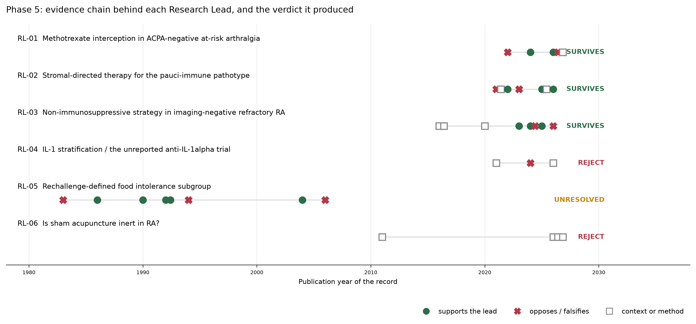

> **Archived phase report — a dated record of what was believed at the time, not the current state of the project.**
> Statements superseded by later verification are listed in `data/corrections_log.csv`. Check that log before citing anything in this file.
> Current lead status is in `data/research_leads_status.csv`.

> **Six statements in this file were corrected by the targeted verification round (corrections V1-V6).**

# RA Open Therapeutics #001 — Phase 5: Deep Investigation of the Six Research Leads

**Scope.** Phase 4 promoted six of twenty-two Phase 3 signals to Research Leads. This phase investigates all six in depth before any retain-or-reject decision, as instructed, with the aim of minimising false negatives as well as false positives. No lead was eliminated on preliminary screening. Verification worked from primary records — PubMed abstracts retrieved through E-utilities, ClinicalTrials.gov records retrieved through the registry API, and, for one lead, sponsor disclosure and trade reporting located by web search because the result exists nowhere else.

Nothing here is a treatment recommendation and no claim of efficacy is made for any intervention named. A surviving lead is a statement that a question is open and testable.

## Verdicts

| Lead | Question | Verdict |
|---|---|---|
| **RL-01** | Methotrexate-based interception in ACPA-negative at-risk arthralgia | SURVIVES (reframed) |
| **RL-02** | Stromal/fibroblast-directed therapy for the pauci-immune (fibroid) pathotype | SURVIVES (narrowed; Phase 4 error corrected) |
| **RL-03** | Non-immunosuppressive strategy for imaging-negative refractory RA | SURVIVES |
| **RL-04** | IL-1 stratification and the unreported anti-IL-1alpha trial | DOWNGRADE / REJECT (question resolved) |
| **RL-05** | Rechallenge-defined food-intolerance subgroup | UNRESOLVED — insufficient evidence |
| **RL-06** | Whether sham acupuncture is inert in RA | DOWNGRADE / REJECT (reclassified as a methodological caveat) |

Three leads survive, one is rejected because its question was answered, one is rejected as a methodological caveat rather than a therapeutic direction, and one is unresolved. The three survivors are not ranked: they address different populations with different evidence types, and nothing in the record supports ordering them.

## Corrections to earlier phases

Two Phase 4 statements were wrong and are corrected explicitly rather than silently.

**C1 — RL-02.** Phase 4 stated that no interventional stromal- or fibroblast-directed trial had been conducted in RA. This is false. TRAFIC (PMID 33928262, ISRCTN36667085) was an open-label dose-finding phase 1b of the CDK inhibitor seliciclib in patients with active RA despite anti-TNF therapy; it enrolled 15 patients across five cohorts and established a maximum tolerated dose of 400 mg. A phase 1b of the next-generation CDK4/6 inhibitor TCK-276 in RA patients has since been published (PMID 41328586). The narrower Phase 4 claim survives: no stromal-directed agent has been tested in a biopsy- or signature-selected RA population. The error arose because the Phase 4 registry sweep searched for fibroblast and anti-fibrotic terms and for FAP, and missed cell-cycle inhibitors entirely.

**C2 — RL-05.** Phase 4 treated the 1992 food-intolerance finding as an observation that was never followed up. It was followed up. A chain of blinded food-challenge work runs from 1983 to 2006 (PMIDs 6838671, 3513771, 2332849, 1575571, 1575572, 8070160, 15304675, 16025333). What Phase 4 recorded as a research gap was a retrieval gap in its own search strategy. The genuine gap is the twenty years of silence since 2006.

A third item is a correction to the public record rather than to this project: press coverage of the anti-IL-1alpha phase 2 cites NCT05363917, but the registry entry matching the reported design and enrolment is NCT05363891. Both are XBiotech RA phase 2 registrations and neither has posted results.

## How each lead was tested

Each lead was put through the same sequence: retrieve the primary records behind the Phase 4 claim and read them rather than the summary; trace the evidence chain forward and backward for replications, contradictions and newer work; check whether an apparent absence of evidence is a genuine gap or a retrieval gap by searching the trial registry and, where PubMed was silent, non-indexed sources; examine design, endpoints, subgroup definition, effect size and precision; and search deliberately for evidence that would falsify the lead. Mechanistic plausibility was gathered where relevant but is not counted as evidence of efficacy.

## RL-01 — Methotrexate-based interception in ACPA-negative at-risk arthralgia

**Verdict: SURVIVES (reframed)**

**Hypothesis.** In ACPA-negative individuals with clinically suspect arthralgia, subclinical joint inflammation and predicted risk >10%, a time-limited 12-month methotrexate course reduces 5-year progression to clinical RA relative to placebo, with the effect concentrated in those with multi-site tenosynovitis/osteitis.

**Deciding evidence.** TREAT EARLIER 5-year ACPA-stratified analysis (PMID 42392130): 3/35 (9%) vs 10/31 (32%) progressed to RA in ACPA-negative increased-risk participants, HR 0.24 (95% CI 0.07-0.87), p=0.018, NNT 4, with sustained HAQ benefit (-0.16, 95% CI -0.29 to -0.04); no effect in ACPA-positive (HR 0.75, 0.38-1.49). Randomisation was stratified for ACPA. No interception trial anywhere enrols ACPA-negative at-risk individuals as its target population.

**Strongest opposing evidence.** Same-trial MRI responder analysis (PMID 41558803): MRI treatment response was predicted by baseline subclinical inflammation burden (tenosynovitis/osteitis, PPV 77-79%) and positive predictive values were similar in ACPA-positive and ACPA-negative patients — i.e. at the tissue level the responder is defined by inflammation load, not serostatus. Trial primary endpoint at 2 years was negative overall (PMID 35871815). The 5-year analysis is restricted to 120/236 participants at >10% predicted risk and reports two primary endpoints; no formal ACPA-by-treatment interaction test is given in the abstract.

**Critical remaining uncertainty.** Whether the ACPA-negative advantage is a differential treatment effect or a difference in natural history — ACPA-negative at-risk disease progresses more slowly and with a different inflammatory profile (PMID 42203632), so the same absolute effect could produce a larger apparent hazard reduction.

**Next step.** A prospective interception RCT enrolling ACPA-negative CSA with MRI-confirmed multi-site tenosynovitis, powered for RA development, with ACPA status and imaging burden as prespecified stratification factors and a prespecified interaction test. Falsified if progression rates are equal between arms, or if imaging burden rather than serostatus explains the effect.

## RL-02 — Stromal/fibroblast-directed therapy for the pauci-immune (fibroid) pathotype

**Verdict: SURVIVES (narrowed; Phase 4 error corrected)**

**Hypothesis.** Among biologic-refractory RA patients whose pre-treatment synovial biopsy shows a pauci-immune/stromal-high molecular signature, a fibroblast-directed agent produces a greater clinical response than continued immune-directed therapy.

**Deciding evidence.** R4RA biomarker analysis (PMID 35589854) identifies a stromal/fibroblast signature specifically in patients refractory to all medications, with a multidrug-resistance prediction model (AUC 0.69). STRAP deep molecular profiling (PMID 40603860, n=208) yields drug-specific response models (AUC 0.748-0.763), externally validated in R4RA (AUC 0.713-0.786) and reproduced on a 524-gene panel (AUC 0.82-0.87). The pauci-immune pathotype is present in up to a quarter of treatment-naive early RA and predicts poor response across TNF inhibitors, rituximab and tocilizumab (PMID 42662104).

**Strongest opposing evidence.** STRAP primary endpoint (PMID 38251532, n=223): dichotomous B-cell-poor vs -rich histological classification did not predict response — ACR20 60% vs 59%, OR 1.02 (95% CI 0.47-2.17), p=0.97. R4RA primary (PMID 33485455) likewise failed on histology (45% vs 56%, p=0.31) and reached significance only after RNA-seq reclassification (36% vs 63%, p=0.035). CORRECTION to Phase 4: the claim that no interventional stromal-directed trial exists in RA is false — TRAFIC (seliciclib, ISRCTN36667085, PMID 33928262) established a maximum tolerated dose of 400 mg in anti-TNF-refractory RA with two drug-related serious adverse events in 15 patients, and a phase 1b of the next-generation CDK4/6 inhibitor TCK-276 in RA has been published (PMID 41328586).

**Critical remaining uncertainty.** Whether the pauci-immune/stromal signature is a treatment-selection biomarker or only a prognostic marker of refractoriness. No stromal-directed agent has ever been tested in a pathotype- or signature-selected RA population; every trial to date enrolled unselected refractory patients.

**Next step.** A biopsy-stratified randomised trial of a fibroblast-directed agent (a next-generation CDK4/6 inhibitor being the only class with an established RA dose and published phase 1b) versus an immune-directed comparator, enriched for the stromal signature using the validated 524-gene panel. Falsified if response is unrelated to stromal signature status.

## RL-03 — Non-immunosuppressive strategy for imaging-negative refractory RA

**Verdict: SURVIVES**

**Hypothesis.** In EULAR-defined difficult-to-treat RA with no power Doppler synovitis in any swollen joint, a strategy of b/tsDMARD de-escalation plus targeted non-immunosuppressive management of central pain is non-inferior to continued escalation for disease activity and radiographic progression at 12 months.

**Deciding evidence.** 43% of EULAR difficult-to-treat RA patients have no ultrasound synovitis in any swollen joint (46/107; PMID 38059326), replicated at 44% (20/45) in an independent cohort (PMID 42370095); less than 60% of D2T-RA has objective signs of inflammation. Fibromyalgia affects roughly 1 in 5 inflammatory arthritis patients, inflates tender joint count and patient global assessment, and drives repeated DMARD switching (PMID 36478185). Adding imaging to escalation decisions has failed in three trials — ARCTIC (PMID 27530741), TaSER (PMID 27026689) and the ARCTIC MRI analysis (PMID 31999341, erosive progression 39% vs 33%, RR 1.16, 95% CI 0.81-1.66). No registered trial tests treatment de-escalation or a non-immunosuppressive strategy in the imaging-negative refractory group.

**Strongest opposing evidence.** Power Doppler status separates the refractory population poorly on the very axis the lead depends on: fibromyalgia prevalence was 48% in Doppler-positive and 40% in Doppler-negative D2T-RA, and 46% of patients with well-controlled refractory RA had subclinical synovitis (PMID 42370095). Baseline grey-scale and power Doppler scores did not predict 12-month treatment response in D2T-RA (PMID 38085537). The systematic literature review supporting ultrasound phenotyping of D2T-RA rests on three studies totalling 159 patients (PMID 39557317).

**Critical remaining uncertainty.** Whether ultrasound-defined absence of synovitis is a safe and valid criterion for withholding or withdrawing immunosuppression — no study has followed imaging-negative refractory patients through de-escalation, so the structural-damage risk of being wrong is unmeasured.

**Next step.** A randomised strategy trial in Doppler-negative D2T-RA comparing continued escalation with protocolised de-escalation plus central-pain management, with radiographic progression as a co-primary safety endpoint. Falsified if the de-escalation arm shows excess radiographic progression or flare.

## RL-04 — IL-1 stratification and the unreported anti-IL-1alpha trial

**Verdict: DOWNGRADE / REJECT (question resolved)**

**Deciding evidence.** The lead's own falsification condition — a single successful retrieval of the missing result — was met outside PubMed and the registry. In December 2024 the sponsor disclosed that the phase 2 study missed its endpoints, paused the rheumatology programme indefinitely, and stated it would investigate irregularities in the trial; trade reporting describes subjects enrolled multiple times. The registry record (NCT05363891, XBiotech, n=243, primary endpoint ACR20 at 12 weeks, completed 31 Oct 2024) still has no posted results.

**Strongest opposing evidence.** The sponsor's own report of data irregularities makes this a compromised null rather than a clean negative, so it does not formally exclude an IL-1-responsive subgroup. A second XBiotech RA phase 2 (NCT05363917, n=150, completion Feb 2023) is also unreported with status listed as unknown, and press coverage cites that identifier for the 230-patient study whose design matches NCT05363891 — the identifier attribution in secondary sources is unreliable.

**Critical remaining uncertainty.** Whether any IL-1-responsive RA subgroup exists is now untestable from this trial's data, which have not been published or posted; no validated IL-1 biomarker exists to define such a subgroup prospectively.

**Next step.** Not a research lead. Two open documentation items remain and are worth preserving: full results for NCT05363891 and NCT05363917 have not been posted well past the usual reporting window, and the nature of the reported irregularities has not been made public.

## RL-05 — Rechallenge-defined food-intolerance subgroup

**Verdict: UNRESOLVED — insufficient evidence**

**Hypothesis.** A minority (order 10%) of patients with active RA who report food-triggered flares show reproducible increases in objective inflammatory measures on blinded encapsulated challenge with the implicated food, and not on placebo challenge.

**Deciding evidence.** Two independent centres reported objective responders under blinded conditions. Panush and colleagues completed 19 double-blind encapsulated food challenges in 16 patients; 3 showed subjective and objective rheumatic symptoms (PMID 2332849), following a single blinded milk-challenge case (PMID 3513771). In a 94-patient controlled elimination trial, 9 patients improved and then flared markedly on rechallenge with changes in objective disease activity measures (PMID 1575571); placebo-controlled rechallenge confirmed intolerance in 4 of 6, with reduced synovial and small-intestinal mast cells in 2 who had raised IgE (PMID 1575572).

**Strongest opposing evidence.** The two positive series disagree on who the responder is: Panush's three responders were all seronegative with palindromic, non-erosive disease — arguably not definite RA — whereas the 1992 responders were rheumatoid-factor seropositive. Group-level trials are null: a 10-week double-blind randomised diet trial found no differences across 183 variables (PMID 6838671) and an elemental-diet pilot found no between-group difference (PMID 8070160). The only modern positive studies (PMID 15304675, 16025333) were not placebo-controlled, and their own data show the rise in TNF-alpha, IL-1beta, ESR and CRP persisted after the offending foods were removed again, which is inconsistent with a food-specific trigger. A 2025 umbrella review of dietary interventions in RA (PMID 40054644) rates all evidence low to very low and does not cover elimination-rechallenge designs.

**Critical remaining uncertainty.** Whether a reproducible food-triggered inflammatory subgroup exists at all, and if so whether those patients have RA or a palindromic/seronegative mimic. CORRECTION to Phase 4: the premise that this signal was abandoned after 1992 and never followed up was wrong — a blinded-challenge chain runs 1983-2006. The genuine gap is the 20 years since.

**Next step.** A series of randomised, placebo-controlled n-of-1 encapsulated-challenge crossovers in RA patients reporting food-triggered flares, with objective endpoints (CRP, ultrasound synovitis, swollen joint count) and prespecified per-patient response criteria, plus full serological and imaging phenotyping of any responders. Falsified if challenge and placebo periods are indistinguishable on objective measures.

## RL-06 — Whether sham acupuncture is inert in RA

**Verdict: DOWNGRADE / REJECT (reclassified as a methodological caveat)**

**Deciding evidence.** The question is real but not RA-specific and is already being addressed in other conditions. Sham needling is not inert: in insomnia trials sham acupuncture improved PSQI by 1.43 points (95% CI 0.91-1.94) from baseline (PMID 41198522). Three-armed trials with placebo and no-treatment arms — the design needed to measure this — are themselves subject to publication bias (PMID 21655196). The RA-specific network meta-analysis notes that efficacy estimates are confounded by variability in sham technique (PMID 41102052), and consensus guidance concludes no standardised inert sham exists (PMID 42209373).

**Strongest opposing evidence.** No RA-specific three-armed trial with a no-treatment arm exists, so the magnitude of the non-specific effect in RA is genuinely unmeasured. A registry and PubMed search returned no such RA trial.

**Critical remaining uncertainty.** How large the non-specific component is in RA specifically — but resolving it would refine interpretation of an already weak acupuncture evidence base rather than identify a therapeutic direction.

**Next step.** Carry as a standing methodological caveat on the acupuncture entries in the Treatment Map: RA acupuncture effect estimates versus sham are not interpretable as specific effects, and any future RA acupuncture trial should include a no-treatment or waiting-list arm alongside sham.

## Negative and null findings preserved

- Ultrasound-guided treat-to-target adds nothing to escalation in early RA: ARCTIC (PMID 27530741), TaSER (PMID 27026689), and the ARCTIC MRI analysis showing no difference in inflammation or erosive progression over two years (PMID 31999341). An MRI-guided strategy trial (NCT01656278) belongs to the same family.
- Histological pathotype classification failed as a treatment-selection tool in both biopsy-driven randomised trials (PMID 38251532, PMID 33485455); only molecular reclassification recovered a signal.
- Group-level elimination diets in RA are null (PMID 6838671, PMID 8070160), and a 2025 umbrella review of dietary interventions rates the entire field low to very low quality with total glucosides of paeony the only intervention reducing both disease activity score and ESR (PMID 40054644).
- The anti-IL-1alpha phase 2 missed its endpoints and the sponsor halted rheumatology development; the trial is additionally compromised by reported enrolment irregularities.
- No RA acupuncture trial with a no-treatment or waiting-list arm alongside sham was found in PubMed or the registry.
- No registered trial anywhere tests treatment de-escalation in imaging-negative refractory RA, and no interception trial enrols ACPA-negative at-risk individuals as its target population. These two are genuine gaps, not retrieval gaps: both were checked against the registry with condition and intervention queries.

## Limitations of this phase

- Effect estimates were read from abstracts and registry fields. Full texts were not obtained; several claims that matter for RL-01 in particular — whether the ACPA subgroup analysis was prespecified as an analysis rather than only as a randomisation stratification factor, and whether a formal interaction test was performed — cannot be settled from the abstract and require the published paper and its protocol.
- Retrieval covered PubMed, ClinicalTrials.gov and, for RL-04 only, open web sources. Trials registered solely in EudraCT/CTIS, the Chinese registry, UMIN or jRCT would not appear. Conference abstracts were not systematically searched.
- RL-05's evidence base is almost entirely pre-2007 and much of it predates modern RA classification criteria; the responder phenotypes described may not map onto RA as defined today.
- The direction assigned to each record in the figure (supports, opposes, context) is this analysis's judgement, not a property of the source.